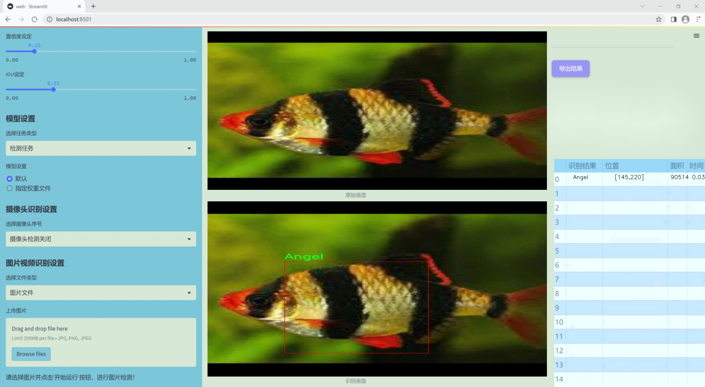
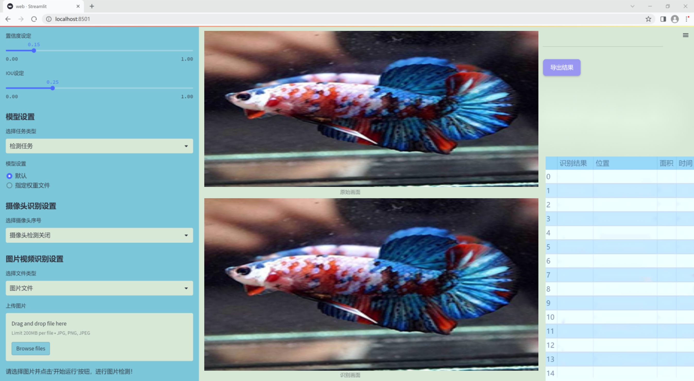
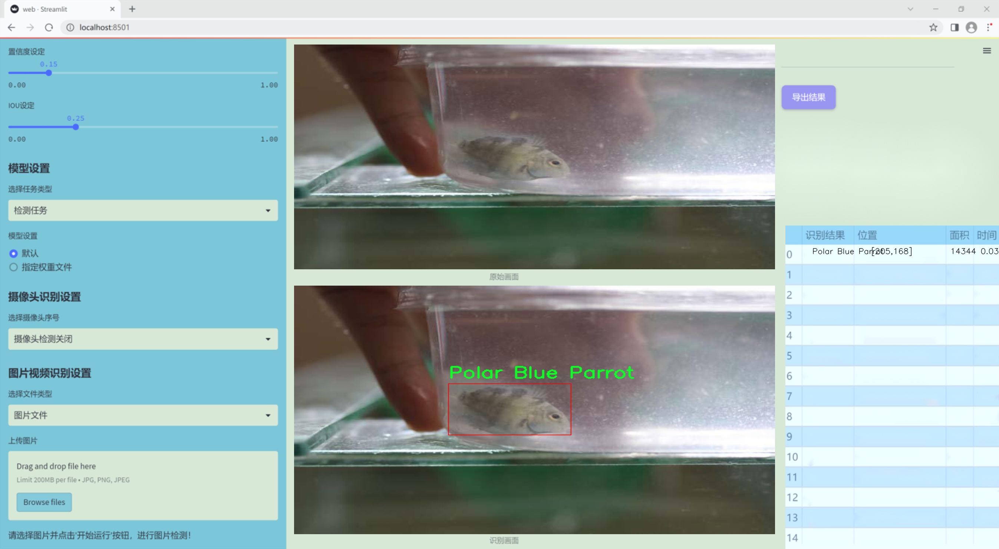
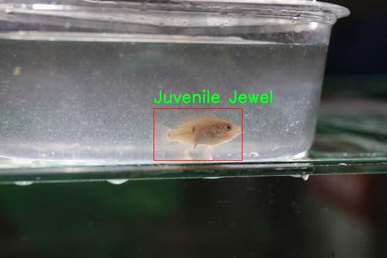
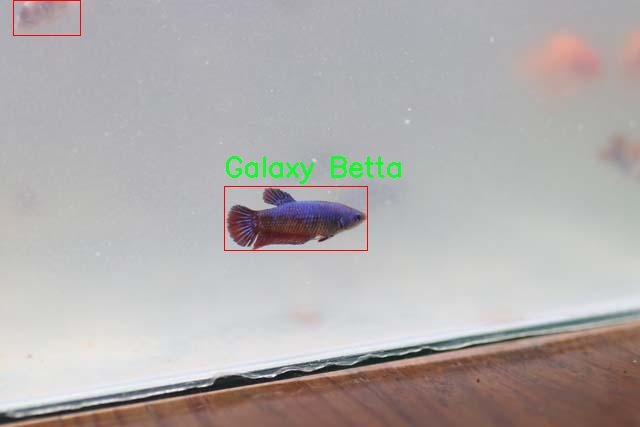
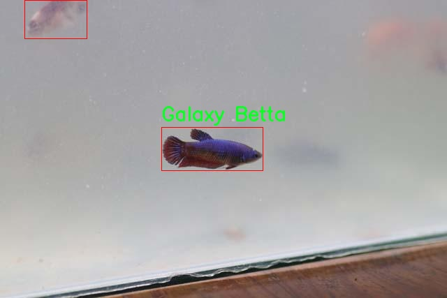
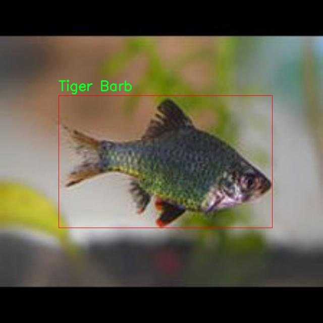
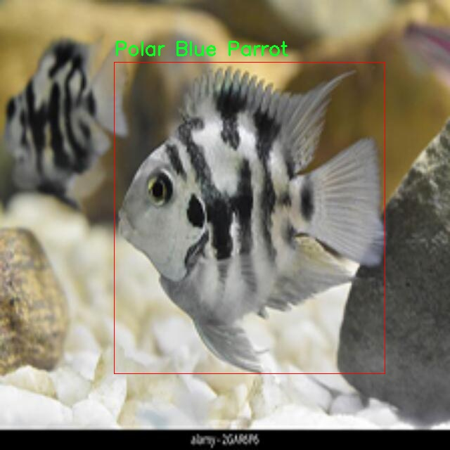

# 改进yolo11-SEAMHead等200+全套创新点大全：观赏淡水鱼检测系统源码＆数据集全套

### 1.图片效果展示







##### 项目来源 **[人工智能促进会 2024.11.01](https://kdocs.cn/l/cszuIiCKVNis)**

注意：由于项目一直在更新迭代，上面“1.图片效果展示”和“2.视频效果展示”展示的系统图片或者视频可能为老版本，新版本在老版本的基础上升级如下：（实际效果以升级的新版本为准）

  （1）适配了YOLOV11的“目标检测”模型和“实例分割”模型，通过加载相应的权重（.pt）文件即可自适应加载模型。

  （2）支持“图片识别”、“视频识别”、“摄像头实时识别”三种识别模式。

  （3）支持“图片识别”、“视频识别”、“摄像头实时识别”三种识别结果保存导出，解决手动导出（容易卡顿出现爆内存）存在的问题，识别完自动保存结果并导出到tempDir中。

  （4）支持Web前端系统中的标题、背景图等自定义修改。

  另外本项目提供训练的数据集和训练教程,暂不提供权重文件（best.pt）,需要您按照教程进行训练后实现图片演示和Web前端界面演示的效果。

### 2.视频效果展示

[2.1 视频效果展示](https://www.bilibili.com/video/BV1dADAYKEUL/)

### 3.背景

研究背景与意义

随着城市化进程的加快和人们生活水平的提高，观赏淡水鱼作为一种新兴的宠物，逐渐受到越来越多家庭的青睐。观赏淡水鱼不仅能够美化家庭环境，还能为人们的生活增添乐趣，促进心理健康。因此，针对观赏淡水鱼的养殖、管理和保护等相关研究显得尤为重要。然而，传统的观赏淡水鱼识别方法往往依赖于人工观察，效率低下且容易出现误判。为了解决这一问题，基于深度学习的目标检测技术逐渐被引入到观赏淡水鱼的识别和分类中。

本研究旨在基于改进的YOLOv11模型，构建一个高效的观赏淡水鱼检测系统。YOLO（You Only Look Once）系列模型因其高效的实时检测能力而广泛应用于各类目标检测任务。通过对YOLOv11进行改进，我们希望能够提升其在观赏淡水鱼检测中的准确性和鲁棒性。数据集包含2000张图像，涵盖了多个观赏淡水鱼种类，如天使鱼、斗鱼、锦鲤等，具有较高的多样性和代表性。这为模型的训练和测试提供了丰富的样本基础。

通过本研究，我们不仅能够实现对观赏淡水鱼的自动化识别，还能为相关行业提供技术支持，推动观赏淡水鱼养殖和销售的智能化发展。此外，该系统的成功应用将为生态保护和生物多样性研究提供重要的数据支持，促进人们对观赏淡水鱼及其栖息环境的关注与保护。综上所述，本研究具有重要的理论意义和实际应用价值。

### 4.数据集信息展示

##### 4.1 本项目数据集详细数据（类别数＆类别名）

nc: 10
names: ['Angel', 'Candy Koi Betta', 'Galaxy Betta', 'Gemrin Koi', 'Guppy Dumbo', 'Juvenile Jewel', 'Marble Molly', 'Polar Blue Parrot', 'Rancho', 'Tiger Barb']


该项目为【目标检测】数据集，请在【训练教程和Web端加载模型教程（第三步）】这一步的时候按照【目标检测】部分的教程来训练

##### 4.2 本项目数据集信息介绍

本项目数据集信息介绍

本项目旨在改进YOLOv11的观赏淡水鱼检测系统，所使用的数据集名为“Ornamental Freshwater Fish”。该数据集专门针对观赏淡水鱼的多样性进行了精心的收集与标注，包含了10个不同的鱼类类别，具体包括：天使鱼（Angel）、糖果锦鲤斗鱼（Candy Koi Betta）、银河斗鱼（Galaxy Betta）、宝石锦鲤（Gemrin Koi）、小丑龙鱼（Guppy Dumbo）、幼年珠宝鱼（Juvenile Jewel）、大理石莫莉鱼（Marble Molly）、极地蓝鹦鹉鱼（Polar Blue Parrot）、兰乔鱼（Rancho）以及虎吧鱼（Tiger Barb）。这些鱼类不仅在水族爱好者中备受欢迎，也在生态系统中扮演着重要的角色。

数据集的构建过程经过严格的筛选和标注，确保每一类鱼的特征都得到了充分的体现。每个类别的样本数量经过精心设计，以保证模型在训练过程中能够充分学习到各类鱼的特征差异。数据集中包含了多种不同的拍摄角度、光照条件和背景环境，以增强模型的鲁棒性和适应性。此外，数据集中的图像均经过高质量的处理，确保在训练时能够提供清晰、准确的视觉信息。

通过使用“Ornamental Freshwater Fish”数据集，我们的目标是提升YOLOv11在观赏淡水鱼检测任务中的性能，使其能够更准确地识别和分类不同种类的鱼类。这不仅有助于推动水族养殖行业的发展，也为相关的生态研究提供了数据支持。随着模型的不断优化，我们期待能够在观赏淡水鱼的检测与分类领域取得显著的进展。











### 5.全套项目环境部署视频教程（零基础手把手教学）

[5.1 所需软件PyCharm和Anaconda安装教程（第一步）](https://www.bilibili.com/video/BV1BoC1YCEKi/?spm_id_from=333.999.0.0&vd_source=bc9aec86d164b67a7004b996143742dc)


[5.2 安装Python虚拟环境创建和依赖库安装视频教程（第二步）](https://www.bilibili.com/video/BV1ZoC1YCEBw?spm_id_from=333.788.videopod.sections&vd_source=bc9aec86d164b67a7004b996143742dc)

### 6.改进YOLOv11训练教程和Web_UI前端加载模型教程（零基础手把手教学）

[6.1 改进YOLOv11训练教程和Web_UI前端加载模型教程（第三步）](https://www.bilibili.com/video/BV1BoC1YCEhR?spm_id_from=333.788.videopod.sections&vd_source=bc9aec86d164b67a7004b996143742dc)


按照上面的训练视频教程链接加载项目提供的数据集，运行train.py即可开始训练



     Epoch   gpu_mem       box       obj       cls    labels  img_size
     1/200     20.8G   0.01576   0.01955  0.007536        22      1280: 100%|██████████| 849/849 [14:42<00:00,  1.04s/it]
               Class     Images     Labels          P          R     mAP@.5 mAP@.5:.95: 100%|██████████| 213/213 [01:14<00:00,  2.87it/s]
                 all       3395      17314      0.994      0.957      0.0957      0.0843

     Epoch   gpu_mem       box       obj       cls    labels  img_size
     2/200     20.8G   0.01578   0.01923  0.007006        22      1280: 100%|██████████| 849/849 [14:44<00:00,  1.04s/it]
               Class     Images     Labels          P          R     mAP@.5 mAP@.5:.95: 100%|██████████| 213/213 [01:12<00:00,  2.95it/s]
                 all       3395      17314      0.996      0.956      0.0957      0.0845

     Epoch   gpu_mem       box       obj       cls    labels  img_size
     3/200     20.8G   0.01561    0.0191  0.006895        27      1280: 100%|██████████| 849/849 [10:56<00:00,  1.29it/s]
               Class     Images     Labels          P          R     mAP@.5 mAP@.5:.95: 100%|███████   | 187/213 [00:52<00:00,  4.04it/s]
                 all       3395      17314      0.996      0.957      0.0957      0.0845


###### [项目数据集下载链接](https://kdocs.cn/l/cszuIiCKVNis)

### 7.原始YOLOv11算法讲解


ultralytics发布了最新的作品YOLOv11，这一次YOLOv11的变化相对于ultralytics公司的上一代作品YOLOv8变化不是很大的（YOLOv9、YOLOv10均不是ultralytics公司作品），其中改变的位置涉及到C2f变为C3K2，在SPPF后面加了一层类似于注意力机制的C2PSA，还有一个变化大家从yaml文件是看不出来的就是它的检测头内部替换了两个DWConv，以及模型的深度和宽度参数进行了大幅度调整，但是在损失函数方面就没有变化还是采用的CIoU作为边界框回归损失，下面带大家深入理解一下ultralytics最新作品YOLOv11的创新点。

**下图为最近的YOLO系列发布时间线！**


* * *

###### YOLOv11和YOLOv8对比

在YOLOYOLOv5，YOLOv8，和YOLOv11是ultralytics公司作品（ultralytics出品必属精品），下面用一张图片从yaml文件来带大家对比一下YOLOv8和YOLOv11的区别，配置文件变得内容比较少大家可以看一卡，左侧为YOLOv8右侧为YOLOv11，不同的点我用黑线标注了出来。


* * *

###### YOLOv11的网络结构解析

下面的图片为YOLOv11的网络结构图。


**其中主要创新点可以总结如下- > **

* * *

1\.
提出C3k2机制，其中C3k2有参数为c3k，其中在网络的浅层c3k设置为False（下图中可以看到c3k2第二个参数被设置为False，就是对应的c3k参数）。


此时所谓的C3k2就相当于YOLOv8中的C2f，其网络结构为一致的，其中的C3k机制的网络结构图如下图所示
**（为什么叫C3k2，我个人理解是因为C3k的调用时C3k其中的参数N固定设置为2的原因，个人理解不一定对** ）。


* * *

2\.
第二个创新点是提出C2PSA机制，这是一个C2（C2f的前身）机制内部嵌入了一个多头注意力机制，在这个过程中我还发现作者尝试了C2fPSA机制但是估计效果不如C2PSA，有的时候机制有没有效果理论上真的很难解释通，下图为C2PSA机制的原理图，仔细观察把Attention哪里去掉则C2PSA机制就变为了C2所以我上面说C2PSA就是C2里面嵌入了一个PSA机制。


* * *

3\.
第三个创新点可以说是原先的解耦头中的分类检测头增加了两个DWConv，具体的对比大家可以看下面两个图下面的是YOLOv11的解耦头，上面的是YOLOv8的解耦头.


我们上面看到了在分类检测头中YOLOv11插入了两个DWConv这样的做法可以大幅度减少参数量和计算量（原先两个普通的Conv大家要注意到卷积和是由3变为了1的，这是形成了两个深度可分离Conv），大家可能不太理解为什么加入了两个DWConv还能够减少计算量，以及什么是深度可分离Conv，下面我来解释一下。

> **`DWConv` 代表 Depthwise
> Convolution（深度卷积）**，是一种在卷积神经网络中常用的高效卷积操作。它主要用于减少计算复杂度和参数量，尤其在移动端或轻量化网络（如
> MobileNet）中十分常见。
>
> **1\. 标准卷积的计算过程**
>
> 在标准卷积操作中，对于一个输入张量（通常是一个多通道的特征图），卷积核的尺寸是 `(h, w, C_in)`，其中 `h` 和 `w`
> 是卷积核的空间尺寸，`C_in`
> 是输入通道的数量。而卷积核与输入张量做的是完整的卷积运算，每个输出通道都与所有输入通道相连并参与卷积操作，导致计算量比较大。
>
> 标准卷积的计算过程是这样的：
>
>   * 每个输出通道是所有输入通道的组合（加权求和），卷积核在每个位置都会计算与所有输入通道的点积。
>   * 假设有 `C_in` 个输入通道和 `C_out` 个输出通道，那么卷积核的总参数量是 `C_in * C_out * h * w`。
>

>
> 2\. **Depthwise Convolution（DWConv）**
>
> 与标准卷积不同， **深度卷积** 将输入的每个通道单独处理，即 **每个通道都有自己的卷积核进行卷积**
> ，不与其他通道进行交互。它可以被看作是标准卷积的一部分，专注于空间维度上的卷积运算。
>
> **深度卷积的计算过程：**
>
>   * 假设输入张量有 `C_in` 个通道，每个通道会使用一个 `h × w`
> 的卷积核进行卷积操作。这个过程称为“深度卷积”，因为每个通道独立进行卷积运算。
>   * 输出的通道数与输入通道数一致，每个输出通道只和对应的输入通道进行卷积，没有跨通道的组合。
>   * 参数量和计算量相比标准卷积大大减少，卷积核的参数量是 `C_in * h * w`。
>

>
> **深度卷积的优点：**
>
>   1. **计算效率高** ：相对于标准卷积，深度卷积显著减少了计算量。它只处理空间维度上的卷积，不再处理通道间的卷积。
>   2.  **参数量减少** ：由于每个卷积核只对单个通道进行卷积，参数量大幅减少。例如，标准卷积的参数量为 `C_in * C_out * h *
> w`，而深度卷积的参数量为 `C_in * h * w`。
>   3.  **结合点卷积可提升效果** ：为了弥补深度卷积缺乏跨通道信息整合的问题，通常深度卷积后会配合 `1x1` 的点卷积（Pointwise
> Convolution）使用，通过 `1x1` 的卷积核整合跨通道的信息。这种组合被称为 **深度可分离卷积** （Depthwise
> Separable Convolution） | **这也是我们本文YOLOv11中的做法** 。
>

>
> 3\. **深度卷积与标准卷积的区别**
>
> 操作类型| 卷积核大小| 输入通道数| 输出通道数| 参数量  
> ---|---|---|---|---  
> 标准卷积| `h × w`| `C_in`| `C_out`| `C_in * C_out * h * w`  
> 深度卷积（DWConv）| `h × w`| `C_in`| `C_in`| `C_in * h * w`  
>  
> 可以看出，深度卷积在相同的卷积核大小下，参数量减少了约 `C_out` 倍
> （细心的人可以发现用最新版本的ultralytics仓库运行YOLOv8参数量相比于之前的YOLOv8以及大幅度减少了这就是因为检测头改了的原因但是名字还是Detect，所以如果你想继续用YOLOv8发表论文做实验那么不要更新最近的ultralytics仓库）。
>
> **4\. 深度可分离卷积 (Depthwise Separable Convolution)**
>
> 深度卷积常与 `1x1` 的点卷积配合使用，这称为深度可分离卷积。其过程如下：
>
>   1. 先对输入张量进行深度卷积，对每个通道独立进行空间卷积。
>   2. 然后通过 `1x1` 点卷积，对通道维度进行混合，整合不同通道的信息。
>

>
> 这样既可以保证计算量的减少，又可以保持跨通道的信息流动。
>
> 5\. **总结**
>
> `DWConv` 是一种高效的卷积方式，通过单独处理每个通道来减少计算量，结合 `1x1`
> 的点卷积，形成深度可分离卷积，可以在保持网络性能的同时极大地减少模型的计算复杂度和参数量。

**看到这里大家应该明白了为什么加入了两个DWConv还能减少参数量以及YOLOv11的检测头创新点在哪里。**

* * *

##### YOLOv11和YOLOv8还有一个不同的点就是其各个版本的模型（N - S - M- L - X）网络深度和宽度变了


可以看到在深度（depth）和宽度
（width）两个地方YOLOv8和YOLOv11是基本上完全不同了，这里我理解这么做的含义就是模型网络变小了，所以需要加深一些模型的放缩倍数来弥补模型之前丧失的能力从而来达到一个平衡。

> **本章总结：**
> YOLOv11的改进点其实并不多更多的都是一些小的结构上的创新，相对于之前的YOLOv5到YOLOv8的创新，其实YOLOv11的创新点不算多，但是其是ultralytics公司的出品，同时ultralytics仓库的使用量是非常多的（不像YOLOv9和YOLOv10）所以在未来的很长一段时间内其实YOLO系列估计不会再更新了，YOLOv11作为最新的SOTA肯定是十分适合大家来发表论文和创新的。
>

### 8.200+种全套改进YOLOV11创新点原理讲解

#### 8.1 200+种全套改进YOLOV11创新点原理讲解大全

由于篇幅限制，每个创新点的具体原理讲解就不全部展开，具体见下列网址中的改进模块对应项目的技术原理博客网址【Blog】（创新点均为模块化搭建，原理适配YOLOv5~YOLOv11等各种版本）

[改进模块技术原理博客【Blog】网址链接](https://gitee.com/qunmasj/good)


#### 8.2 精选部分改进YOLOV11创新点原理讲解

###### 这里节选部分改进创新点展开原理讲解(完整的改进原理见上图和[改进模块技术原理博客链接](https://gitee.com/qunmasj/good)【如果此小节的图加载失败可以通过CSDN或者Github搜索该博客的标题访问原始博客，原始博客图片显示正常】
### CBAM空间注意力机制
近年来，随着深度学习研究方向的火热，注意力机制也被广泛地应用在图像识别、语音识别和自然语言处理等领域，注意力机制在深度学习任务中发挥着举足轻重的作用。注意力机制借鉴于人类的视觉系统，例如，人眼在看到一幅画面时，会倾向于关注画面中的重要信息，而忽略其他可见的信息。深度学习中的注意力机制和人类视觉的注意力机制相似，通过扫描全局数据，从大量数据中选择出需要重点关注的、对当前任务更为重要的信息，然后对这部分信息分配更多的注意力资源，从这些信息中获取更多所需要的细节信息，而抑制其他无用的信息。而在深度学习中，则具体表现为给感兴趣的区域更高的权重，经过网络的学习和调整，得到最优的权重分配，形成网络模型的注意力，使网络拥有更强的学习能力，加快网络的收敛速度。
注意力机制通常可分为软注意力机制和硬注意力机制[4-5]。软注意力机制在选择信息时，不是从输入的信息中只选择1个，而会用到所有输入信息，只是各个信息对应的权重分配不同，然后输入网络模型进行计算;硬注意力机制则是从输入的信息中随机选取一个或者选择概率最高的信息，但是这一步骤通常是不可微的，导致硬注意力机制更难训练。因此，软注意力机制应用更为广泛，按照原理可将软注意力机制划分为:通道注意力机制（channel attention)、空间注意力机制(spatial attention）和混合域注意力机制(mixed attention)。
通道注意力机制的本质建立各个特征通道之间的重要程度，对感兴趣的通道进行重点关注，弱化不感兴趣的通道的作用;空间注意力的本质则是建模了整个空间信息的重要程度，然后对空间内感兴趣的区域进行重点关注，弱化其余非感兴趣区域的作用;混合注意力同时运用了通道注意力和空间注意力，两部分先后进行或并行，形成对通道特征和空间特征同时关注的注意力模型。

卷积层注意力模块(Convolutional Block Attention Module，CBAM）是比较常用的混合注意力模块，其先后集中了通道注意力模块和空间注意力模块，网络中加入该模块能有效提高网络性能，减少网络模型的计算量，模块结构如图所示。输入特征图首先经过分支的通道注意力模块，然后和主干的原特征图融合，得到具有通道注意力的特征图，接着经过分支的空间注意力模块，在和主干的特征图融合后，得到同时具有通道特征注意力和空间特征注意力的特征图。CBAM模块不改变输入特征图的大小，因此该模块是一个“即插即用”的模块，可以插入网络的任何位置。

通道注意力模块的结构示意图如图所示，通道注意力模块分支并行地对输入的特征图进行最大池化操作和平均池化操作，然后利用多层感知机对结果进行变换，得到应用于两个通道的变换结果，最后经过sigmoid激活函数将变换结果融合，得到具有通道注意力的通道特征图。

空间注意力模块示意图如图所示，将通道注意力模块输出的特征图作为该模块的输入特征图，首先对输入特征图进行基于通道的最大池化操作和平均池化操作，将两部分得到的结果拼接起来，然后通过卷积得到降为Ⅰ通道的特征图，最后通过sigmoid激活函数生成具有空间注意力的特征图。


### 9.系统功能展示

图9.1.系统支持检测结果表格显示

  图9.2.系统支持置信度和IOU阈值手动调节

  图9.3.系统支持自定义加载权重文件best.pt(需要你通过步骤5中训练获得)

  图9.4.系统支持摄像头实时识别

  图9.5.系统支持图片识别

  图9.6.系统支持视频识别

  图9.7.系统支持识别结果文件自动保存

  图9.8.系统支持Excel导出检测结果数据


### 10. YOLOv11核心改进源码讲解

#### 10.1 ui.py

以下是对代码的核心部分进行提炼和详细注释的版本：

```python
import sys  # 导入sys模块，用于访问与Python解释器紧密相关的变量和函数
import subprocess  # 导入subprocess模块，用于执行外部命令

def run_script(script_path):
    """
    使用当前 Python 环境运行指定的脚本。

    Args:
        script_path (str): 要运行的脚本路径

    Returns:
        None
    """
    # 获取当前 Python 解释器的路径
    python_path = sys.executable

    # 构建运行命令，使用streamlit运行指定的脚本
    command = f'"{python_path}" -m streamlit run "{script_path}"'

    # 执行命令，并等待其完成
    result = subprocess.run(command, shell=True)
    
    # 检查命令执行的返回码，0表示成功，非0表示出错
    if result.returncode != 0:
        print("脚本运行出错。")

# 实例化并运行应用
if __name__ == "__main__":
    # 指定要运行的脚本路径
    script_path = "web.py"  # 这里可以直接指定脚本名，假设在当前目录下

    # 调用函数运行脚本
    run_script(script_path)
```

### 代码核心部分说明：
1. **导入模块**：
   - `sys`模块用于获取当前Python解释器的路径。
   - `subprocess`模块用于执行外部命令，能够创建新的进程并与之交互。

2. **`run_script`函数**：
   - 该函数接受一个脚本路径作为参数，并在当前Python环境中运行该脚本。
   - 使用`sys.executable`获取当前Python解释器的路径，以确保使用正确的Python版本。
   - 构建一个命令字符串，使用`streamlit`模块运行指定的脚本。
   - 使用`subprocess.run`执行命令，并通过`result.returncode`检查命令是否成功执行。

3. **主程序入口**：
   - 在`__main__`块中，指定要运行的脚本路径，并调用`run_script`函数来执行该脚本。

这个程序文件名为 `ui.py`，它的主要功能是通过当前的 Python 环境来运行一个指定的脚本。文件中首先导入了必要的模块，包括 `sys`、`os` 和 `subprocess`，以及一个自定义的路径处理函数 `abs_path`，这个函数来自于 `QtFusion.path` 模块。

在 `run_script` 函数中，首先获取当前 Python 解释器的路径，存储在 `python_path` 变量中。接着，构建一个命令字符串，这个命令用于调用 `streamlit` 来运行指定的脚本。具体来说，命令的格式是 `"{python_path}" -m streamlit run "{script_path}"`，其中 `script_path` 是要运行的脚本的路径。

然后，使用 `subprocess.run` 方法来执行这个命令。`shell=True` 参数表示在一个新的 shell 中执行命令。执行完命令后，程序会检查返回的状态码，如果状态码不为零，说明脚本运行出错，此时会打印出错误信息。

在文件的最后部分，使用 `if __name__ == "__main__":` 语句来确保只有在直接运行该文件时才会执行以下代码。这里指定了要运行的脚本路径，调用 `abs_path` 函数来获取 `web.py` 的绝对路径。最后，调用 `run_script` 函数来运行这个脚本。

总体来说，这个文件的功能是为用户提供一个简单的接口，通过该接口可以方便地运行一个名为 `web.py` 的脚本，主要用于 Streamlit 应用的启动。

#### 10.2 SMPConv.py

以下是代码中最核心的部分，并附上详细的中文注释：

```python
import torch
import torch.nn as nn
import torch.nn.functional as F

# 定义一个函数用于生成相对位置坐标
def rel_pos(kernel_size):
    # 生成从-1到1的线性空间，步数为kernel_size
    tensors = [torch.linspace(-1, 1, steps=kernel_size) for _ in range(2)]
    # 创建网格坐标
    kernel_coord = torch.stack(torch.meshgrid(*tensors), dim=-0)
    kernel_coord = kernel_coord.unsqueeze(0)  # 增加一个维度
    return kernel_coord

# 定义SMPConv类，继承自nn.Module
class SMPConv(nn.Module):
    def __init__(self, planes, kernel_size, n_points, stride, padding, groups):
        super().__init__()

        self.planes = planes  # 输出通道数
        self.kernel_size = kernel_size  # 卷积核大小
        self.n_points = n_points  # 关键点数量
        self.init_radius = 2 * (2/kernel_size)  # 初始化半径

        # 生成卷积核坐标
        kernel_coord = rel_pos(kernel_size)
        self.register_buffer('kernel_coord', kernel_coord)  # 注册为buffer，不会被视为模型参数

        # 初始化权重坐标
        weight_coord = torch.empty(1, n_points, 2)
        nn.init.trunc_normal_(weight_coord, std=0.2, a=-1., b=1.)  # 使用截断正态分布初始化
        self.weight_coord = nn.Parameter(weight_coord)  # 注册为可训练参数

        # 初始化半径参数
        self.radius = nn.Parameter(torch.empty(1, n_points).unsqueeze(-1).unsqueeze(-1))
        self.radius.data.fill_(value=self.init_radius)  # 填充初始值

        # 初始化权重
        weights = torch.empty(1, planes, n_points)
        nn.init.trunc_normal_(weights, std=.02)  # 使用截断正态分布初始化
        self.weights = nn.Parameter(weights)  # 注册为可训练参数

    def forward(self, x):
        # 生成卷积核并增加维度
        kernels = self.make_kernels().unsqueeze(1)
        x = x.contiguous()  # 确保输入张量在内存中是连续的
        kernels = kernels.contiguous()  # 确保卷积核在内存中是连续的

        # 根据输入数据类型选择不同的卷积实现
        if x.dtype == torch.float32:
            x = _DepthWiseConv2dImplicitGEMMFP32.apply(x, kernels)  # FP32卷积
        elif x.dtype == torch.float16:
            x = _DepthWiseConv2dImplicitGEMMFP16.apply(x, kernels)  # FP16卷积
        else:
            raise TypeError("Only support fp32 and fp16, get {}".format(x.dtype))  # 抛出异常
        return x        

    def make_kernels(self):
        # 计算卷积核的差异
        diff = self.weight_coord.unsqueeze(-2) - self.kernel_coord.reshape(1, 2, -1).transpose(1, 2)  # [1, n_points, kernel_size^2, 2]
        diff = diff.transpose(2, 3).reshape(1, self.n_points, 2, self.kernel_size, self.kernel_size)  # 重塑形状
        diff = F.relu(1 - torch.sum(torch.abs(diff), dim=2) / self.radius)  # 计算ReLU激活后的差异

        # 计算卷积核
        kernels = torch.matmul(self.weights, diff.reshape(1, self.n_points, -1))  # [1, planes, kernel_size*kernel_size]
        kernels = kernels.reshape(1, self.planes, *self.kernel_coord.shape[2:])  # [1, planes, kernel_size, kernel_size]
        kernels = kernels.squeeze(0)  # 去掉多余的维度
        kernels = torch.flip(kernels.permute(0, 2, 1), dims=(1,))  # 反转卷积核的维度
        return kernels

    def radius_clip(self, min_radius=1e-3, max_radius=1.):
        # 限制半径的范围
        r = self.radius.data
        r = r.clamp(min_radius, max_radius)  # 限制在[min_radius, max_radius]之间
        self.radius.data = r

# 定义SMPCNN类，继承自nn.Module
class SMPCNN(nn.Module):
    def __init__(self, in_channels, out_channels, kernel_size, stride, groups, n_points=None, n_points_divide=4):
        super().__init__()
        self.kernel_size = kernel_size
        if n_points is None:
            n_points = int((kernel_size**2) // n_points_divide)  # 计算关键点数量

        padding = kernel_size // 2  # 计算填充
        self.smp = conv_bn(in_channels=in_channels, out_channels=out_channels, kernel_size=kernel_size,
                           stride=stride, padding=padding, dilation=1, groups=groups, n_points=n_points)

        self.small_kernel = 5  # 小卷积核大小
        self.small_conv = Conv(in_channels, out_channels, self.small_kernel, stride, self.small_kernel // 2, groups, act=False)  # 小卷积层

    def forward(self, inputs):
        out = self.smp(inputs)  # 通过SMP卷积层
        out += self.small_conv(inputs)  # 加上小卷积层的输出
        return out
```

### 代码核心部分说明：
1. **SMPConv类**：实现了一种特殊的卷积操作，使用了相对位置编码和动态生成卷积核的方式。该类的构造函数中初始化了卷积核的坐标、权重坐标和半径参数，并在前向传播中根据输入数据类型选择不同的卷积实现。

2. **make_kernels方法**：计算并生成卷积核，利用权重和差异计算卷积核的最终形状。

3. **SMPCNN类**：将SMP卷积与小卷积结合在一起，形成一个复合卷积层。通过在前向传播中将两者的输出相加，增强特征提取能力。

以上是代码的核心部分及其详细注释，帮助理解其功能和实现方式。

这个程序文件 `SMPConv.py` 定义了一些用于深度学习的卷积模块，主要是基于 PyTorch 框架实现的。文件中包含了多个类和函数，主要功能是实现一种特殊的卷积操作和相关的神经网络结构。

首先，文件导入了必要的库，包括 PyTorch 的核心模块和一些自定义的模块。接着，定义了一个辅助函数 `rel_pos`，用于生成相对位置的坐标张量，这在后续的卷积操作中会用到。

接下来，定义了 `SMPConv` 类，这是一个自定义的卷积层。该类的构造函数接受多个参数，包括输出通道数、卷积核大小、点数、步幅、填充和分组数。`SMPConv` 通过计算相对位置坐标和权重坐标来生成卷积核，并在前向传播中使用深度可分离卷积的实现。前向传播中，输入数据和生成的卷积核会被传递到深度可分离卷积的实现中进行计算。`make_kernels` 方法负责生成卷积核，而 `radius_clip` 方法用于限制半径的范围。

`get_conv2d` 函数用于根据输入参数选择合适的卷积层，如果满足特定条件，则返回 `SMPConv`，否则返回标准的 `nn.Conv2d`。

接下来，定义了一些辅助函数，如 `enable_sync_bn` 和 `get_bn`，用于选择使用同步批归一化或普通批归一化。`conv_bn` 和 `conv_bn_relu` 函数则是构建包含卷积层和批归一化层的顺序模块，并可选择性地添加激活函数。

`fuse_bn` 函数用于将卷积层和批归一化层融合，以提高推理效率。

`SMPCNN` 类是一个更复杂的网络结构，包含了 `SMPConv` 和一个小卷积层。它在前向传播中将两者的输出相加，从而结合了不同尺度的特征。

`SMPCNN_ConvFFN` 类实现了一个前馈网络，包含了两个逐点卷积层和一个非线性激活函数，使用了残差连接和 DropPath 技术来增强网络的表现。

最后，`SMPBlock` 类实现了一个包含多个卷积层和非线性激活的模块，利用了前馈网络和卷积层的组合，提供了更强的特征提取能力。

整体来看，这个文件实现了一种新的卷积操作和网络结构，旨在提高深度学习模型的性能，尤其是在处理图像数据时。通过自定义的卷积层和结构，能够更灵活地控制模型的参数和计算方式。

#### 10.3 test_selective_scan_speed.py

以下是经过简化和注释的核心代码部分，主要集中在 `build_selective_scan_fn` 函数及其内部的 `SelectiveScanFn` 类。这个类实现了前向和反向传播的自定义操作，主要用于选择性扫描（selective scan）操作。

```python
import torch
import torch.nn.functional as F

def build_selective_scan_fn(selective_scan_cuda: object = None, mode="mamba_ssm", tag=None):
    """
    构建选择性扫描函数，返回一个自定义的前向和反向传播函数。
    
    参数:
    selective_scan_cuda: CUDA实现的选择性扫描函数
    mode: 选择的模式
    tag: 标签，用于标识
    """
    
    class SelectiveScanFn(torch.autograd.Function):
        @staticmethod
        def forward(ctx, u, delta, A, B, C, D=None, z=None, delta_bias=None, delta_softplus=False, return_last_state=False, nrows=1, backnrows=-1):
            """
            前向传播函数，执行选择性扫描操作。
            
            参数:
            ctx: 上下文对象，用于保存信息以供反向传播使用
            u: 输入张量
            delta: 变化率张量
            A, B, C: 权重张量
            D: 可选的额外输入
            z: 可选的张量
            delta_bias: 可选的偏置
            delta_softplus: 是否使用softplus激活
            return_last_state: 是否返回最后状态
            nrows: 行数
            backnrows: 反向传播时的行数
            
            返回:
            输出张量或（输出张量，最后状态）
            """
            # 确保输入张量是连续的
            if u.stride(-1) != 1:
                u = u.contiguous()
            if delta.stride(-1) != 1:
                delta = delta.contiguous()
            if D is not None:
                D = D.contiguous()
            if B.stride(-1) != 1:
                B = B.contiguous()
            if C.stride(-1) != 1:
                C = C.contiguous()
            if z is not None and z.stride(-1) != 1:
                z = z.contiguous()

            # 检查输入的形状和类型
            assert u.shape[1] % (B.shape[1] * nrows) == 0 
            assert nrows in [1, 2, 3, 4]  # 限制行数为1到4
            
            # 选择不同的模式执行前向扫描
            if mode == "mamba_ssm":
                out, x, *rest = selective_scan_cuda.fwd(u, delta, A, B, C, D, z, delta_bias, delta_softplus)
            else:
                raise NotImplementedError("未实现的模式")

            # 保存必要的上下文信息
            ctx.delta_softplus = delta_softplus
            ctx.has_z = z is not None
            last_state = x[:, :, -1, 1::2]  # 获取最后状态

            # 保存用于反向传播的张量
            ctx.save_for_backward(u, delta, A, B, C, D, delta_bias, x)
            return out if not return_last_state else (out, last_state)

        @staticmethod
        def backward(ctx, dout):
            """
            反向传播函数，计算梯度。
            
            参数:
            ctx: 上下文对象，包含前向传播时保存的信息
            dout: 上游梯度
            
            返回:
            各个输入的梯度
            """
            # 从上下文中恢复前向传播时保存的张量
            u, delta, A, B, C, D, delta_bias, x = ctx.saved_tensors
            
            # 调用CUDA实现的反向传播
            du, ddelta, dA, dB, dC, dD, ddelta_bias, *rest = selective_scan_cuda.bwd(
                u, delta, A, B, C, D, delta_bias, dout, x, ctx.delta_softplus
            )

            return (du, ddelta, dA, dB, dC, dD if D is not None else None, None, ddelta_bias if delta_bias is not None else None)

    # 返回选择性扫描函数
    return SelectiveScanFn.apply
```

### 代码注释说明：
1. **build_selective_scan_fn**: 该函数用于构建选择性扫描的自定义函数，返回一个可以在PyTorch中使用的前向和反向传播的操作。
2. **SelectiveScanFn**: 这是一个继承自 `torch.autograd.Function` 的类，包含了前向和反向传播的实现。
3. **forward**: 实现了选择性扫描的前向传播逻辑，处理输入的张量并调用CUDA实现的前向函数。
4. **backward**: 实现了反向传播逻辑，计算梯度并返回给定输入的梯度。

该代码片段的核心功能是通过自定义的前向和反向传播操作实现选择性扫描的高效计算，适用于深度学习模型中的序列数据处理。

这个程序文件 `test_selective_scan_speed.py` 是一个用于测试选择性扫描（Selective Scan）算法性能的脚本，主要依赖于 PyTorch 库。程序中定义了一些函数和类，用于实现选择性扫描的前向和反向传播计算，并通过不同的模式和配置进行性能测试。

首先，程序导入了必要的库，包括 PyTorch、数学运算库、Einops（用于张量重排）和时间模块。接着，定义了一个构建选择性扫描函数的工厂函数 `build_selective_scan_fn`，该函数接受一个 CUDA 实现的选择性扫描函数和模式参数，返回一个自定义的选择性扫描函数。

在 `SelectiveScanFn` 类中，定义了前向传播和反向传播的静态方法。前向传播方法 `forward` 接受多个输入参数，包括输入张量 `u`、`delta`、以及权重矩阵 `A`、`B`、`C` 和可选的 `D`、`z` 等。它首先确保输入张量是连续的，并根据需要调整它们的形状。然后，根据不同的模式调用相应的 CUDA 实现的前向函数，计算输出和中间状态，并将必要的张量保存以供反向传播使用。

反向传播方法 `backward` 负责计算梯度。它从上下文中恢复保存的张量，并调用相应的 CUDA 实现的反向函数来计算梯度。最后，将计算得到的梯度返回。

程序还定义了几个选择性扫描的参考实现函数，如 `selective_scan_ref` 和 `selective_scan_easy`，这些函数实现了选择性扫描的基本逻辑，并提供了不同的输入处理方式。

在 `test_speed` 函数中，设置了一些测试参数，包括数据类型、序列长度、批次大小等。然后生成随机输入数据，并使用不同的选择性扫描实现进行性能测试。测试包括前向传播和前向-反向传播的时间测量，并打印出每个测试的执行时间。

总体而言，这个程序的主要目的是实现和测试选择性扫描算法的不同实现，以便比较它们的性能，特别是在 GPU 上的运行效率。通过对不同参数和模式的实验，开发者可以找到最佳的实现方式，以提高计算效率。

#### 10.4 prepbn.py

以下是代码中最核心的部分，并附上详细的中文注释：

```python
import torch
import torch.nn as nn

# 定义一个自定义的批量归一化类 RepBN
class RepBN(nn.Module):
    def __init__(self, channels):
        super(RepBN, self).__init__()
        # 初始化一个可学习的参数 alpha，初始值为1
        self.alpha = nn.Parameter(torch.ones(1))
        # 初始化一个一维批量归一化层
        self.bn = nn.BatchNorm1d(channels)

    def forward(self, x):
        # 将输入张量的维度进行转置，交换第1维和第2维
        x = x.transpose(1, 2)
        # 先进行批量归一化，然后加上 alpha 乘以原始输入
        x = self.bn(x) + self.alpha * x
        # 再次转置回原来的维度
        x = x.transpose(1, 2)
        return x

# 定义一个线性归一化类 LinearNorm
class LinearNorm(nn.Module):
    def __init__(self, dim, norm1, norm2, warm=0, step=300000, r0=1.0):
        super(LinearNorm, self).__init__()
        # 注册一些缓冲区变量，用于控制训练过程中的参数
        self.register_buffer('warm', torch.tensor(warm))  # 预热步数
        self.register_buffer('iter', torch.tensor(step))   # 当前迭代步数
        self.register_buffer('total_step', torch.tensor(step))  # 总步数
        self.r0 = r0  # 初始比例因子
        # 初始化两个归一化层
        self.norm1 = norm1(dim)
        self.norm2 = norm2(dim)

    def forward(self, x):
        # 如果模型处于训练模式
        if self.training:
            # 如果还有预热步数
            if self.warm > 0:
                # 预热阶段，减少预热步数并使用 norm1 进行归一化
                self.warm.copy_(self.warm - 1)
                x = self.norm1(x)
            else:
                # 计算当前的比例因子 lamda
                lamda = self.r0 * self.iter / self.total_step
                # 如果还有迭代步数，减少迭代步数
                if self.iter > 0:
                    self.iter.copy_(self.iter - 1)
                # 使用两个不同的归一化方法进行归一化
                x1 = self.norm1(x)
                x2 = self.norm2(x)
                # 线性组合两个归一化的结果
                x = lamda * x1 + (1 - lamda) * x2
        else:
            # 如果模型处于评估模式，直接使用 norm2 进行归一化
            x = self.norm2(x)
        return x
```

### 代码核心部分说明：
1. **RepBN 类**：实现了一个自定义的批量归一化层，增加了一个可学习的参数 `alpha`，使得模型在进行批量归一化的同时，可以保留一定比例的原始输入。

2. **LinearNorm 类**：实现了一个线性归一化的策略，根据训练的进度动态调整归一化的方式。它在预热阶段使用一种归一化方法，之后根据迭代次数在两种归一化方法之间进行线性插值，增强了模型的灵活性和适应性。

这个程序文件定义了两个神经网络模块，分别是 `RepBN` 和 `LinearNorm`，它们都是基于 PyTorch 框架构建的。

`RepBN` 类是一个自定义的批量归一化模块。它的构造函数接收一个参数 `channels`，表示输入数据的通道数。在初始化时，它创建了一个可学习的参数 `alpha`，并实例化了一个标准的批量归一化层 `bn`。在 `forward` 方法中，输入张量 `x` 首先进行维度转换，以适应批量归一化的要求。接着，经过批量归一化处理后，`x` 与 `alpha` 乘以 `x` 的结果相加，最后再进行一次维度转换，返回处理后的张量。这种结构可以增强模型的表达能力，通过引入可学习的参数 `alpha`，使得网络能够在归一化的基础上自适应调整输入。

`LinearNorm` 类则实现了一种线性归一化的策略。它的构造函数接收多个参数，包括维度 `dim`、两个归一化方法 `norm1` 和 `norm2`，以及一些控制参数如 `warm`、`step` 和 `r0`。在初始化时，使用 `register_buffer` 方法注册了一些张量，这些张量在模型训练过程中会保持在 GPU 或 CPU 上，但不会被视为模型的可学习参数。在 `forward` 方法中，如果模型处于训练状态且 `warm` 大于零，则会逐步减少 `warm` 的值，并使用 `norm1` 对输入进行归一化处理。否则，计算一个动态的权重 `lamda`，这个权重与 `iter` 和 `total_step` 有关，用于平衡 `norm1` 和 `norm2` 的输出。最终，返回的结果是根据 `lamda` 加权后的两个归一化结果。如果模型处于评估状态，则直接使用 `norm2` 对输入进行归一化。

整体来看，这个文件实现了两种归一化策略，分别用于不同的场景和需求，增强了模型的灵活性和性能。

注意：由于此博客编辑较早，上面“10.YOLOv11核心改进源码讲解”中部分代码可能会优化升级，仅供参考学习，以“11.完整训练+Web前端界面+200+种全套创新点源码、数据集获取”的内容为准。

### 11.完整训练+Web前端界面+200+种全套创新点源码、数据集获取


# [下载链接：https://mbd.pub/o/bread/Zp6ampZr](https://mbd.pub/o/bread/Zp6ampZr)